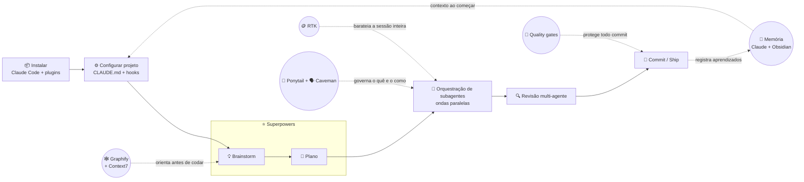

<a id="topo"></a>
<div align="center">

# 🎧 Vibe Coding Toolkit


*O fluxo real de desenvolvimento assistido por IA — testado em produção, não em teoria.*

[](LICENSE)
[](https://docs.claude.com/en/docs/claude-code)
[](https://github.com/soumatheusgomes/vibe-coding-toolkit/pulls)
[](https://instagram.com/matheusgomes)

</div>

---

## <a id="sobre-o-projeto"></a>💡 Sobre o projeto

Programar com IA parece simples até você perceber que "colar um prompt grande e torcer" não é um fluxo de trabalho — é sorte. O **Vibe Coding Toolkit** é o oposto disso: é o fluxo que uso todo santo dia, em código de produção de verdade, pra fazer um agente de IA (Claude Code, principalmente, mas boa parte também vale pro Codex da OpenAI) funcionar como parte de fato do time — não como um estagiário hiperativo que precisa de babá.

Cada peça daqui existe porque resolveu um problema real: sessões que perdiam o fio da meada, agentes que construíam mais do que o pedido, warnings de lint (avisos de uma ferramenta que analisa o código atrás de padrões arriscados, sem precisar executá-lo) que ninguém nunca zerava, lições caras que se repetiam a cada sessão nova porque nada ficava registrado. Nada foi adicionado só "porque parecia legal" — se está aqui, é porque já evitou um problema de verdade pelo menos uma vez.

Um parênteses de transparência: as práticas daqui vêm de um projeto privado real de produção (fintech, sob NDA) — o código de origem não pode ser mostrado, então o que existe aqui é o método já extraído e genericizado, não um changelog público daquele projeto. Por isso o histórico *deste* repositório é curto — aqui é onde o método é documentado, não onde ele foi construído.

Sou o Matheus Gomes — no Instagram ([@matheusgomes](https://instagram.com/matheusgomes)) falo sobre prompt e IA pra devs — e esse repositório é a versão organizada, testável e sem enrolação de tudo que venho ensinando por lá.

**Pra quem é:** devs de qualquer nível — se um termo técnico aparecer, ele é explicado ali mesmo, na primeira vez — que já usam ou estão testando Claude Code / Codex e querem um fluxo estruturado em vez de tentativa e erro.

## <a id="superpowers-primeiro"></a>⭐ Superpowers primeiro

> [!IMPORTANT]
> **Superpowers é, na humilde opinião do autor, a ferramenta mais poderosa de todo este toolkit.** Não é só mais um plugin — é a disciplina que garante que um agente explore a intenção do pedido, planeje, e só então escreva código, em vez de arriscar a primeira interpretação plausível de algo em aberto. Tudo mais neste repositório apoia essa peça; ela sozinha já muda como uma sessão inteira se comporta.
>
> Se você só for configurar **uma** coisa deste repositório, que seja essa: leia [`docs/tools/01-superpowers.md`](docs/tools/01-superpowers.md) antes de qualquer outra ferramenta daqui.

Dois outros documentos merecem destaque igual, mesmo sem holofote de ferramenta de terceiro puxando atenção pra eles: [orquestração de subagentes em ondas paralelas](docs/tools/02-subagent-orchestration.md) (o protocolo que elimina colisão de arquivo e disputa de commit *na estrutura*, não na disciplina — nada parecido apareceu em nenhuma coleção de terceiro que pesquisei pra este repositório) e [quality gates de ESLint/Biome](docs/tools/06-eslint-biome-quality-gates.md) (promoção de aviso pra erro como migração rastreada, fronteira de arquitetura imposta via lint). Se Superpowers é o motor, esses dois são o chassi.

## <a id="comece-por-aqui"></a>🚀 Comece por aqui

Se é sua primeira vez por aqui, não tente ler tudo em ordem — vá direto pro **[Playbook completo](docs/02-playbook-onboarding.md)**. É o guia de onboarding do zero até um projeto real com o setup inteiro funcionando, com um exemplo ponta a ponta em vez de teoria solta.

Um teaser do que te espera lá — os primeiros comandos, antes de qualquer coisa mais sofisticada. Repare que isso é "copie o arquivo certo, digite o comando certo" — não existe (ainda) um instalador que detecta sua stack sozinho e escreve tudo por você. Se é exatamente isso que você quer, pule direto pro atalho do `aia-harness` (`/aia-harness:init`) descrito em [`docs/01-installation.md`](docs/01-installation.md#2-plugins-e-clis-independentes) — ele monta a base sozinho; o resto deste repositório vira material pra entender o que foi montado, não pra montar do zero:

```bash
npm install -g @anthropic-ai/claude-code
/plugin marketplace add anthropics/claude-plugins-official
/plugin install superpowers@claude-plugins-official
cp templates/CLAUDE.md.template CLAUDE.md
```

Isso já deixa o Claude Code instalado, a ferramenta mais importante do toolkit ativa, e o template de instruções de projeto no lugar certo. O resto — orquestração de subagentes, quality gates, memória entre sessões — o Playbook mostra em ordem, com o porquê de cada peça antes do como.

### Ou: só o ESLint, numa linha

Se você não quer instalar nada do toolkit e só quer as regras de lint deste
repositório valendo no seu projeto — inclusive o teto de **350 linhas por
arquivo** — cole isto no seu agente (Claude Code, Codex, Cursor, qualquer um
que leia uma URL):

```
Leia https://raw.githubusercontent.com/soumatheusgomes/vibe-coding-toolkit/main/docs/prompts/08-eslint-quality-gates-install.md
e execute o prompt que está nesse arquivo neste projeto. Use MAX_LINES=350.
```

Ele baixa as três regras já escritas e testadas, adapta a configuração pra
estrutura real do seu projeto, e te devolve a lista de arquivos que passaram
do teto. Não conserta nada — medir e consertar são trabalhos separados.

Quando quiser que ele conserte, cole a mesma linha trocando `08-` por
`09-file-size-refactor.md`: aí ele quebra os arquivos grandes em módulos
menores, cortando por responsabilidade (lógica de negócio, componente de UI,
acesso a dados) e não por contagem de linha, um arquivo por commit, com
teste e checagem de tipos rodando entre cada um.

Os dois documentos por extenso:
[08 — instalar e medir](docs/prompts/08-eslint-quality-gates-install.md) e
[09 — quebrar os arquivos grandes](docs/prompts/09-file-size-refactor.md).

## 🧭 Índice

- [💡 Sobre o projeto](#sobre-o-projeto)
- [⭐ Superpowers primeiro](#superpowers-primeiro)
- [🚀 Comece por aqui](#comece-por-aqui)
- [🗺️ O fluxo completo](#o-fluxo-completo)
- [🧑‍💻 Como usar este repositório](#como-usar-este-repositorio)
- [📚 Documentação completa](#documentacao-completa)
- [🙏 Créditos](#creditos)
- [⚖️ Licença](#licenca)
- [👋 Vamos juntos](#vamos-juntos)

---

## <a id="o-fluxo-completo"></a>🗺️ O fluxo completo

Da instalação ao primeiro commit revisado — essa é a jornada completa, e onde cada ferramenta do toolkit entra nela. Uma peça central aparece cedo: **subagentes** (instâncias separadas do agente principal, cada uma especialista num papel — revisor, banco de dados, testes) fazem o trabalho pesado enquanto a sessão principal só planeja e decide.

Nas caixas abaixo, o caminho principal é a linha do tempo da esquerda pra direita; os círculos são as ferramentas de suporte, que não são etapas — ficam ativas o tempo inteiro, moldando como as etapas acontecem por baixo dos panos. Quality gates é uma dessas — protege todo commit, não é um passo único que se cumpre uma vez e some.



Repare que **RTK**, **Ponytail**, **Caveman**, o grafo do **Graphify** (com o **Context7** ao lado, orientando antes de codar) e os **Quality gates** não são paradas do caminho — são camadas ativas o tempo todo. Uma ressalva sobre o RTK especificamente: ele está aqui porque é parte real do fluxo diário do autor, mas [é documentado como padrão pra replicar](docs/tools/03-rtk-token-proxy.md), não como binário público pra instalar — os outros nós deste diagrama, sim. Já a memória (**sistema do Claude** + **Obsidian**) entra dos dois lados: carrega contexto no início da sessão e grava o que valeu a pena aprender no final.

<div align="right"><a href="#topo">▲ voltar ao topo</a></div>

## <a id="como-usar-este-repositorio"></a>🧑‍💻 Como usar este repositório

Não existe um único jeito "certo" de percorrer este repositório — depende do que você já sabe e do que está procurando agora.

- **Quer o setup completo, do zero?** Vá direto pro [Playbook](docs/02-playbook-onboarding.md) — é o caminho guiado, passo a passo, terminando com um projeto real rodando o fluxo inteiro.
- **Já conhece o fluxo e só quer consultar uma ferramenta específica?** [`docs/tools/`](docs/tools/) é a referência — cada arquivo é autocontido, sem depender de você ter lido os outros antes.
- **Só quer copiar um prompt pronto e adaptar pro seu caso?** [`docs/prompts/`](docs/prompts/) tem templates prontos pra colar e ajustar — sanitização de projeto, burndown de lint, code review multi-agente, e mais.
- **Quer só os arquivos de configuração pra colar no seu projeto?** [`templates/`](templates/) tem o `CLAUDE.md.template`, um `settings.json.example` de hooks, e a regra de ondas paralelas pronta pra copiar.
- **Quer o ESLint configurado, com teto de 350 linhas por arquivo, sem configurar nada à mão?** Cole no seu agente:
  > Leia `https://raw.githubusercontent.com/soumatheusgomes/vibe-coding-toolkit/main/docs/prompts/08-eslint-quality-gates-install.md` e execute o prompt que está nesse arquivo neste projeto. Use MAX_LINES=350.

  Ele baixa as regras prontas de [`templates/eslint/`](templates/eslint/), adapta pro seu projeto e reporta quantos arquivos passaram do teto — sem consertar nada. Depois, a mesma linha trocando `08-` por [`09-file-size-refactor.md`](docs/prompts/09-file-size-refactor.md) faz ele quebrar esses arquivos em módulos menores, um por vez, com teste rodando entre cada um.

Um detalhe de idioma, pra não confundir: este README e toda a explicação dentro de `docs/` (o "como", o "por quê", os tutoriais) estão em português — pra você, que me acompanha por aqui, entender tudo sem esforço. A única parte que fica em inglês de propósito são os blocos de prompt prontos pra colar em `docs/prompts/` (o texto que você copia e cola direto num agente de IA) — isso funciona melhor em inglês, universalmente, independente do idioma de quem está lendo a explicação ao redor. Onde um conceito é específico do Claude Code (plugins, hooks, skills), o doc deixa isso explícito — boa parte do resto funciona igual no Codex ou em qualquer outro agente que leia um arquivo de instruções e execute comandos.

---

## <a id="documentacao-completa"></a>📚 Documentação completa

### 📖 Fundamentos

| Doc | Descrição |
|---|---|
| [Visão geral](docs/00-overview.md) | A filosofia por trás de todo o fluxo, pra ler antes de instalar qualquer coisa. Explica por que orquestração, personas, quality gates e memória só fazem sentido de verdade quando funcionam juntos, não isolados. |
| [Instalação](docs/01-installation.md) | Referência rápida e direta: os comandos de instalação de cada plugin e CLI, sem narrativa longa no meio. Use quando já souber o que quer instalar e só precisar do comando exato pra copiar e colar. |
| [Playbook de onboarding](docs/02-playbook-onboarding.md) | **(comece por aqui)** O livro de onboarding completo, passo a passo, do zero até um projeto real com o setup inteiro rodando — com um exemplo ponta a ponta em vez de teoria solta. |

### 🛠️ Ferramentas

| Doc | Descrição |
|---|---|
| ⭐ [Superpowers](docs/tools/01-superpowers.md) | A ferramenta mais poderosa de todo o toolkit: impõe o fluxo brainstorm → plano → implementação → revisão antes de qualquer linha de código. A regra que muda tudo é sutil — invocar a skill certa antes até de fazer uma pergunta de esclarecimento. |
| [Orquestração de subagentes](docs/tools/02-subagent-orchestration.md) | O padrão por trás de tudo: uma sessão principal que só planeja e delega, nunca implementa sozinha, para um time de subagentes especialistas. Inclui o protocolo de ondas paralelas — como rodar tarefas independentes ao mesmo tempo sem dois agentes brigando pelo mesmo arquivo. |
| [RTK — proxy de tokens](docs/tools/03-rtk-token-proxy.md) | Um proxy de linha de comando (CLI) que reescreve comandos repetitivos — status, diff, log — em versões compactas antes de rodar, economizando tokens (a unidade que mede o custo de cada troca de mensagem com o modelo) em sessões longas. Documentado aqui como padrão replicável, não como produto pronto pra baixar. |
| [Ponytail](docs/tools/04-ponytail.md) | A persona do "engenheiro sênior preguiçoso": uma escada de decisão que para na opção mais simples que resolve o problema de verdade, antes de escrever qualquer código. Preguiça aqui é sinônimo de eficiência — nunca de descuido com segurança ou validação. |
| [Caveman](docs/tools/05-caveman.md) | A camada de comunicação: corta enrolação, gentileza forçada e hedging das respostas do agente, sem perder nenhuma informação real. Independente do Ponytail — um governa o que é construído, o outro como o agente fala sobre isso. |
| [Quality gates ESLint/Biome](docs/tools/06-eslint-biome-quality-gates.md) | A documentação mais rica do toolkit: como dividir o trabalho entre dois linters sem sobreposição de regras, e subir um aviso pra erro como migração rastreada em vez de travar o time do dia pro outro. Cobre até os limites de arquitetura entre camadas do código. |
| [Graphify](docs/tools/07-graphify.md) | Transforma uma pasta de código, docs, papers ou imagens num grafo de conhecimento persistente — nós centrais, comunidades, relações entre arquivos. Responde "o que quebra se eu mudar isso" numa consulta só, em vez de dezenas de greps exploratórios. |
| [Obsidian como memória](docs/tools/08-obsidian-memory.md) | Um vault (repositório de notas) do Obsidian como memória de longo prazo do projeto, acessado só via MCP (um protocolo que conecta o agente a ferramentas externas) — nunca por escrita direta em arquivo. É pra onde migra tudo que o índice rápido de memória não tem espaço pra guardar. |
| [Sistema de memória do Claude](docs/tools/09-claude-memory-system.md) | Um índice sempre carregado (`MEMORY.md`) para as lições caras de aprender de novo — um erro corrigido, uma regra de negócio que o código não deixa óbvia. Vem com política de crescimento clara pra ele nunca inchar até virar ruído que ninguém lê. |
| [Hooks — boas práticas](docs/tools/10-hooks-best-practices.md) | Como escrever um hook (um pedacinho de código que roda automaticamente antes ou depois de uma ação do agente) que falha de forma segura em vez de travar a sessão inteira. Cobre um bug sutil e recorrente: `JSON.parse("null")` não lança erro, e isso engana até guarda defensiva. |
| [agent-browser](docs/tools/11-agent-browser.md) | CLI de automação de navegador construída para agentes de IA, não adaptada de ferramenta de teste feita pra humano — trabalha com árvore de acessibilidade em vez de screenshot ou seletor CSS frágil. Aguenta re-renderização de página muito melhor que scraping tradicional. |
| [Context7](docs/tools/12-context7.md) | Servidor MCP que injeta documentação de biblioteca atualizada e versionada direto no contexto do agente — evita a API alucinada de um modelo com data de corte enquanto o código do mundo real seguiu evoluindo. 60 mil+ estrelas, citado em praticamente toda lista de "MCP essencial". |
| [Anthropic Skills](docs/tools/13-anthropics-skills.md) | O repositório oficial da Anthropic com as Skills de referência — geração real de `docx`/`pdf`/`pptx`/`xlsx`, e duas skills "meta" que ensinam a criar suas próprias skills e servidores MCP. Um dos repositórios de IA mais estrelados do GitHub inteiro. |
| [Chrome DevTools MCP](docs/tools/14-chrome-devtools-mcp.md) | Servidor MCP oficial do time do Chrome — dá ao agente acesso a uma sessão real do navegador pra diagnosticar performance, rede e console ao vivo. Complementa o agent-browser: um automatiza um fluxo, o outro investiga o que está acontecendo nele. |

### 📋 Prompts prontos

| Doc | Descrição |
|---|---|
| [Sanitização de projeto](docs/prompts/01-project-sanitation.md) | Prompt pra uma faxina geral no código — mede antes de agir, nunca chuta a gravidade de um problema. Separa correção mecânica de decisão que precisa de aval humano antes de tocar em nada. |
| [ESLint warning burndown](docs/prompts/02-eslint-warning-burndown.md) | Prompt pra zerar uma pilha de warnings de lint sem isso virar refatoração silenciosa. O centro do prompt é um gate de decisão explícito antes de tocar na parte mais arriscada — geralmente uma regra concentrada em arquivos caros de corrigir. |
| [Code review multi-agente](docs/prompts/03-multi-agent-code-review.md) | Prompt pra disparar vários revisores especialistas em paralelo sobre o mesmo diff, cada um sem ver o achado do outro. A etapa que faz diferença é a síntese depois — dedupe, filtro e ranking, não só concatenar tudo. |
| [Brainstorm até plano](docs/prompts/04-brainstorm-to-plan.md) | Prompt pra transformar um pedido em aberto num plano de implementação de verdade, com pergunta de esclarecimento antes de qualquer código e uma checagem de verificação em cada passo do plano. |
| [Parallel wave dispatch](docs/prompts/05-parallel-wave-dispatch.md) | Prompt pra quebrar uma lista de tarefas em ondas paralelas seguras. As duas regras que sustentam tudo — sem dependência entre tarefas da mesma onda, sem sobreposição de arquivo — são o que evita um agente sobrescrever o trabalho do outro. |
| [Memory bootstrap](docs/prompts/06-memory-bootstrap.md) | Prompt pra configurar do zero o sistema de memória em duas camadas num projeto novo: um índice rápido sempre carregado, mais um caminho de migração disciplinado pro armazenamento de longo prazo. |
| [Setup completo de ESLint](docs/prompts/07-eslint-complete-setup.md) | Prompt extenso e opinativo pra montar um `eslint.config.mjs` (ESLint 9, flat config) do zero: erro só pro que é sempre bug, aviso pro que é pressão de refatoração, regras caseiras pra invariante de domínio, lint consciente de tipo isolado num tier separado não-bloqueante. Complementa o burndown acima — use este primeiro pra ter uma config boa, aquele depois pra zerar avisos acumulados. |
| [Instalar os quality gates (teto de 350 linhas)](docs/prompts/08-eslint-quality-gates-install.md) | **(o atalho)** Prompt que aponta o agente pras três regras já escritas e testadas em `templates/eslint/` — ele copia em vez de escrever, então o resultado é sempre o mesmo código. Instala, adapta pros caminhos reais do seu projeto e mede quantas violações existem por regra; deliberadamente não conserta nenhuma. |
| [Quebrar os arquivos gigantes](docs/prompts/09-file-size-refactor.md) | O segundo tempo do 08: pega os arquivos que estouraram o teto e os divide em módulos menores. O que faz funcionar é cortar por responsabilidade e não por contagem de linha — e mandar o agente dizer "sem costura natural" e parar, em vez de inventar abstração só pra satisfazer o linter. |

<div align="right"><a href="#topo">▲ voltar ao topo</a></div>

---

## <a id="creditos"></a>🙏 Créditos

<details>
<summary><strong>Em cima de ombros de gigantes — clique pra expandir</strong></summary>

<br/>

Esse toolkit não nasceu do zero. Ele empacota, documenta e amarra num fluxo só o trabalho de outras pessoas — vale a pena conhecer os projetos originais:

- **[Superpowers](https://github.com/anthropics/claude-plugins-official)** — Anthropic
- **[Ponytail](https://github.com/DietrichGebert/ponytail)** — Dietrich Gebert
- **[Caveman](https://github.com/JuliusBrussee/caveman)** — Julius Brussee
- **[aia-harness](https://github.com/leandrosilvaferreira/claude-plugins-registry)** — Leandro Silva Ferreira
- **[Graphify](https://github.com/Graphify-Labs/graphify)** — Graphify Labs ([`graphifyy` no PyPI](https://pypi.org/project/graphifyy/))
- **[agent-browser](https://github.com/vercel-labs/agent-browser)** — Vercel Labs

</details>

## <a id="licenca"></a>⚖️ Licença

Este projeto está sob licença [MIT](LICENSE) — use, copie, adapte, redistribua. Só não me processa se algo quebrar. 🙂

---

## <a id="vamos-juntos"></a>👋 Vamos juntos

Se esse fluxo te ajudou, valeu passar por aqui — e se você quer mais dicas de prompt e IA no dia a dia, [me segue no Instagram](https://instagram.com/matheusgomes) ([@matheusgomes](https://instagram.com/matheusgomes)). Contribuições, issues e PRs são bem-vindos — abre um lá no [GitHub](https://github.com/soumatheusgomes/vibe-coding-toolkit).

<div align="center">

Feito com 🤖 + ☕, um commit de cada vez.

</div>
